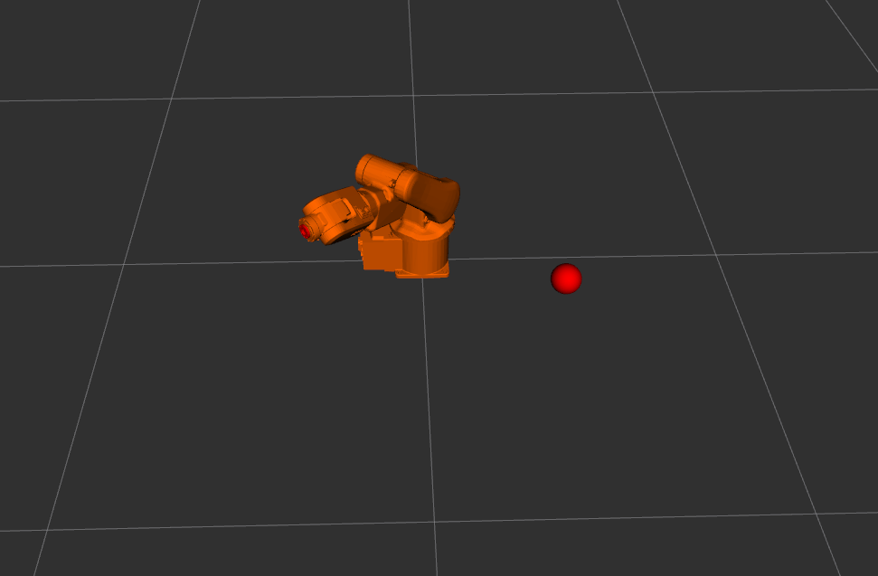
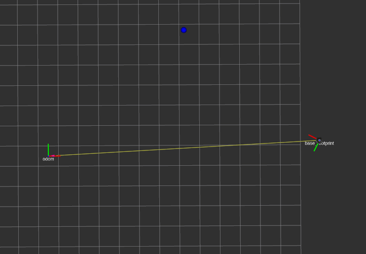
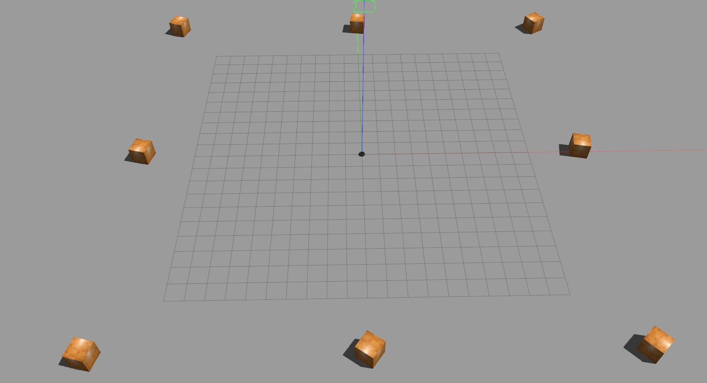
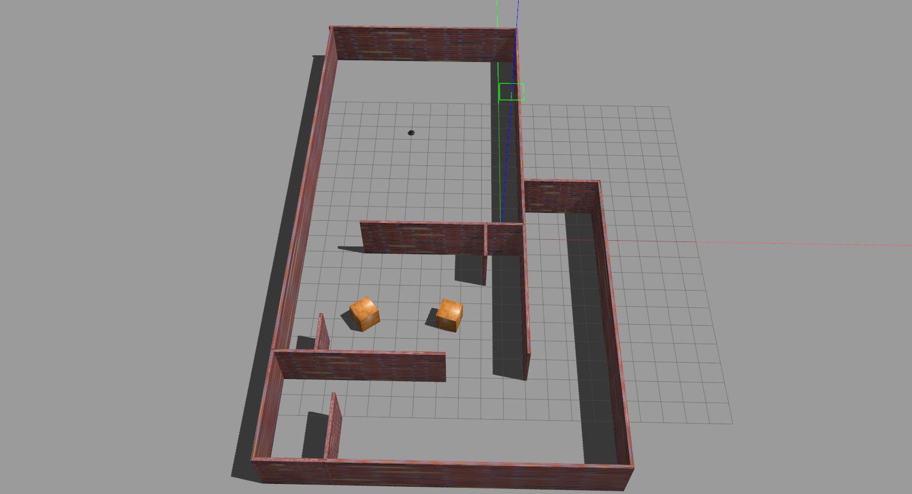

# FRobs_RL Resources

Collection of resource files for [FRobs_RL](https://github.com/jmfajardod/frobs_rl). Includes object meshes, robot descriptions, MoveIt configurations, task enviroments, training logs, trained models, and more.

## Robots resource repositories

List of all robot resources, their source repositories (if available), and what commit the resource was taken from.

| Robot or Resource  | Source                                                  | Commit                                   |
|--------------------|---------------------------------------------------------|------------------------------------------|
| ABB120              | https://github.com/ros-industrial/abb_experimental              | d41bfe3af65b25c4860ec495fd8ccc31e0585480 |
| Kobuki                | https://github.com/yujinrobot/kobuki       | 23748ed3dfb082831ca8eaaef1a0b08588dbcb65 |

## Enviroments list

List of all enviroments with action and observation space.

| Name | Description | Observation Space | Action Space | 
| ---- |  ----------- | ----- | --------- | 
| `ABBIRB120ReacherEnv-v0` | An enviroment where a manipulator robot needs to reach a spatial position. | Box(9,)  | Box(6,) |
| `KobukiEmptyEnv-v0` | A simply enviroment where a Kobuki robot needs to get to a static random position in an empty enviroment. | Box(2,) |  Box(2,) |
| `KobukiDynamicEnv-v3`  | A slightly more complex version of the kobuki enviroment where the robot needs to get to a random position avoiding eight boxes with random velocities and trajectories. To identify the boxes the robots has a LIDAR sensor with 36 rays. | Box(38,) | Box(2,) |
| `KobukiMazeEnv-v0` | The more complex kobuki enviroment where the robot needs to follow 4 discretized trajectories in a maze with dynamic objetcs. To identify the boxes the robot has a LIDAR sensor with 8 rays. To follow the trajectory a midway point reward is used. | Box(15,) | Box(2,) |